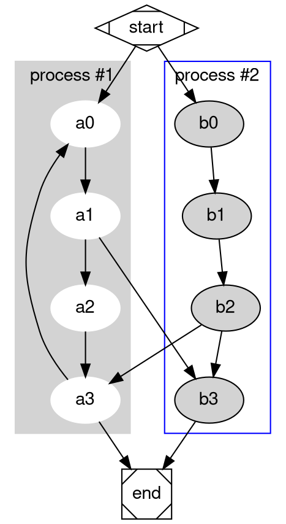

# Crate simple_dot

Simple API for creating GraphViz [DOT language](https://graphviz.org/doc/info/lang.html) files.


[](https://crates.io/crates/simple_dot)
[](https://docs.rs/simple_dot)


[](https://github.com/johnstonskj/rust-simple_dot/stargazers)

TBD

The goal of this crate is to provide an ergonomic interface in a builder style
to make creation of DOT files easy. This sacrifices performance and certainly
memory usage is higher than a crate like [dot](https://crates.io/crates/dot).

## Example 

``` rust
use crate::writer::write_graph;
use crate::graph::{Cluster, Graph, RootGraph};
use crate::node::Node;
use crate::style::{
    ClusterAttributes, ClusterStyles, Color, EdgeAttributes, FontName, GraphAttributes,
    LabelString, NodeAttributes, NodeStyles, Shape, Styled,
};
use crate::writer::Indenter;
use crate::Identifier;
use std::str::FromStr;

let fonts = FontName::list(vec![
    FontName::family("Helvetica").unwrap(),
    FontName::family("Arial").unwrap(),
    FontName::family("sans-serif").unwrap(),
]);
let root = RootGraph::new(Identifier::from_str("G").unwrap(), false, true)
    .set_attributes(GraphAttributes::default().font_name(fonts.clone()))
    .set_default_node_attributes(NodeAttributes::default().font_name(fonts.clone()))
    .set_default_edge_attributes(EdgeAttributes::default().font_name(fonts.clone()))
    .add_sub_graph(
        Cluster::new(0i64.into())
            .set_attributes(
                ClusterAttributes::default()
                    .label(LabelString::from_str("process #1").unwrap())
                    .color(Color::named("lightgrey").unwrap().into())
                    .style(vec![ClusterStyles::Filled]),
            )
            .set_default_node_attributes(
                NodeAttributes::default()
                    .color(Color::named("white").unwrap().into())
                    .style(vec![NodeStyles::Filled]),
            )
            .chain(vec![
                Node::new(Identifier::from_str("a0").unwrap()),
                Node::new(Identifier::from_str("a1").unwrap()),
                Node::new(Identifier::from_str("a2").unwrap()),
                Node::new(Identifier::from_str("a3").unwrap()),
            ]),
    )
    .add_sub_graph(
        Cluster::new(1i64.into())
            .set_attributes(
                ClusterAttributes::default()
                    .label(LabelString::from_str("process #2").unwrap())
                    .color(Color::named("blue").unwrap().into()),
            )
            .set_default_node_attributes(
                NodeAttributes::default().style(vec![NodeStyles::Filled]),
            )
            .chain(vec![
                Node::new(Identifier::from_str("b0").unwrap()),
                Node::new(Identifier::from_str("b1").unwrap()),
                Node::new(Identifier::from_str("b2").unwrap()),
                Node::new(Identifier::from_str("b3").unwrap()),
            ]),
    )
    .add_node(
        Node::new(Identifier::from_str("start").unwrap())
            .set_attributes(NodeAttributes::default().shape(Shape::m_diamond())),
    )
    .add_node(
        Node::new(Identifier::from_str("end").unwrap())
            .set_attributes(NodeAttributes::default().shape(Shape::m_square())),
    )
    .add_edge_between(
        Identifier::from_str("start").unwrap(),
        Identifier::from_str("a0").unwrap(),
    )
    .add_edge_between(
        Identifier::from_str("start").unwrap(),
        Identifier::from_str("b0").unwrap(),
    )
    .add_edge_between(
        Identifier::from_str("a1").unwrap(),
        Identifier::from_str("b3").unwrap(),
    )
    .add_edge_between(
        Identifier::from_str("b2").unwrap(),
        Identifier::from_str("a3").unwrap(),
    )
    .add_edge_between(
        Identifier::from_str("a3").unwrap(),
        Identifier::from_str("a0").unwrap(),
    )
    .add_edge_between(
        Identifier::from_str("a3").unwrap(),
        Identifier::from_str("end").unwrap(),
    )
    .add_edge_between(
        Identifier::from_str("b3").unwrap(),
        Identifier::from_str("end").unwrap(),
    );

write_graph(&root, &mut std::io::stdout()).unwrap();
```



## Changes


**Version 0.1.0**

* Initial version.
